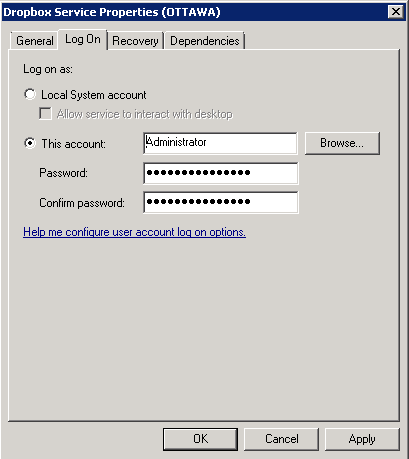

Attivazione di un nuovo progetto
=================================

Installazione Dropbox
---------------------
La prima cosa che essere effettuata è l'installazione di dropbox sul server del cliente.
Per farlo bisogna registrarsi sul sito di dropbox con l'account del cliente. Se il cliente non ce l'ha bisogna crearne uno.
L'installazione di dropbox deve essere fatta in una modalità che ne consente l'esecuzione come servizio.

Dopo aver creato l'account dropbox del cliente, comunicare il nome dell'account ad Apexnet.
Il personale Apexnet attiverà la condivisione della cartella per l'interscambio dei dati dal server appmanager a quello del cliente

Dropbox come servizio
---------------------
Quando si installa il client Dropbox su un server, occorre effettuare alcune operazioni aggiuntive per eseguire il programma come servizio di windows.
L'installazione standard di Dropbox infatti, non prevede l'installazione in questa modalità. Tuttavia con poche semplici operazioni, è possibile risolvere il problema.
L'installazione come servizio, permette di eseguire Dropbox senza dover effettuare il login sul server.

### 1. Installazione del Resource Kit di Windows

Installare, prima di tutto, il "Resource kit di windows."
Si tratta di una utility ufficiale di Microsoft normalmente non presente nel sistema operativo Windows server.
All'interno del resource kit è presente una utility che consente di eseguire un eseguibile generico come servizio di windows.

* Scaricare [w2003 Resource Kit](http://www.microsoft.com/en-us/download/confirmation.aspx?id=17657)
* Installarlo cliccando Next ad ogni richiesta

### 2. Registrazione di un account dropbox

* Collegarsi al sito http://www.dropbox.com e clicccare su '''Sign in'''
* Registrare un account dropbox seguendo le indicazioni presenti.
* Comunicare al supporto apexnet l'utente di dropbox appena creato.

### 3. Installazione del client Dropbox

* Scaricare il client [https://www.dropbox.com/downloading|Dropbox]
* Eseguire il setup del programma
* Inserire le credenziali dell'account dropbox
* Effettuare l'installazione di tipo avanzato e specificare la cartella '''c:\'''.Dropbox verrà installato in '''c:\Dropbox'''
* Clicccare col pulsante destro del mouse nell'icona presente nella tray area in basso a destra, andare nelle preferenze e deselezionare l'opzione '''Avvia dropbox all'avvio del sistema''' (figura 1)

* Uscire da Dropbox

### 4. Configurazione di Dropbox come servizio

Aprire la shell dos e digitare il seguente comando: (fare attenzione al path e agli spazi)

	sc create DropBoxService binPath= "C:\Program Files (x86)\Windows Resource Kits\Tools\srvany.exe" DisplayName= "Dropbox Service"

Otterremo una conferma del tipo

	[SC] CreateService SUCCESS

Andare nei servizi e modificare le proprietà del servizio chiamato Dropbox

Terminati questi passaggi (NON AVVIARE IL SERVIZIO), aprire il registry e andare sotto:

	HKEY_LOCAL_MACHINE\SYSTEM\CurrentControlSet\Services\Dropbox

* Creare una nuova chiave chiamata '''Parameters'''
* Aggiungere una nuova stringa (tipo REG_SZ) dal nome "Application"
* Valorizzarla con il path (eseguibile compreso) di esecuzione di dropbox, ottenibile dallo shortcut del menu dei programmi, ad esempio

	C:\Users\Administrator.XXXXXXXX\AppData\Roaming\Dropbox\bin\Dropbox.exe

* Chiudere il registry ed avviare il servizio
* Fare il logoff ed eseguire un test di funzionamento

Attivazione del progetto
------------------------
Ci deve essere comunicata la lista nominativa delle persone che dovranno utilizzare l'applicazione.
I dati che ci servono, per ogni persona, sono i seguenti:

* Nome
* Cognome
* Indirizzo di posta
* Tipo di licenza da attivare (es: Information, Orders, ecc..)

In seguito all'attivazione di queste informazioni, verranno inviate le credenziali per l'accesso ai singoli utenti.

Installazione connettore
------------------------
Solo alla fine dei precedenti passi, si può procedere con l'installazione del connettore.
L'installazione è semplicissima:

* Devi scompattare uno zip con alcune dll nella cartella di Business ed eseguire il programma (BNIEIBUS).
* Dopo averlo eseguito vai nel registro di business e imposta la cartella dropbox di interscambio dati.
* Ricorda poi di schedulare il file .bub per l'export dei dati (l'export una volta al giorno massimo 2. l'import anche ogni 10 minuti)

Fare riferimento all'articolo 