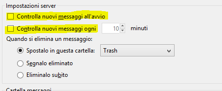
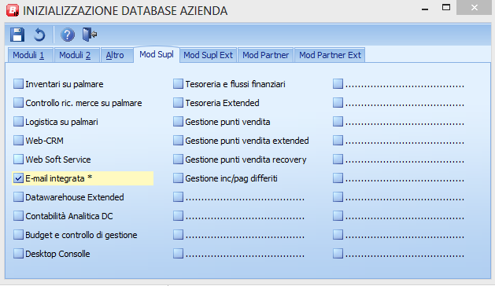
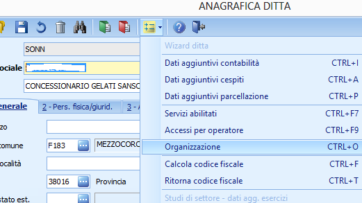
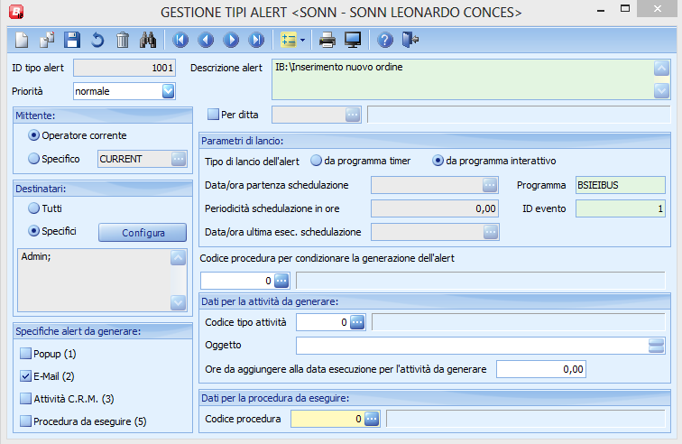
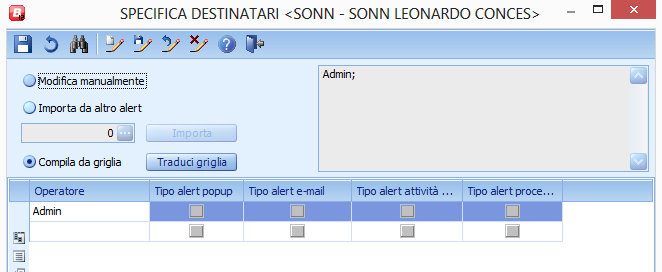

Integrazione con gli Alert di iB
================================

## Introduzione
La gestione degli alert di Business, prevede la possibilità di inviare mail attraverso lo scambio di messaggi MAPI con un client di posta esterno (es: thunderbird, outlook, ecc..).

Sfruttando le funzioni di framework di Business, il connettore di iB genera alcuni eventi che possono essere configurati nella gestione degli alert di Business al fine di compiere operazioni specifiche.

Gli eventi generati dal connettore sono i seguenti:

  *  Event ID: 1 - Import Ordini
  *  Event ID: 2 - Import Leads, note leads, modifiche anagrafiche cliente
  *  Event ID: 99 - Messaggi d'errore

Per configurare l'invio delle mail occorre eseguire alcune attività di configurazione in Business che, per praticità, riportiamo nel seguente documento.

Nota: L'invio delle mail deve essere attivato inserendo la chiave di registro di Business **Abilita_Alert** con valore '''-1''' sulla chiave BSIEIBUS
## Installazione del client di posta
Installate sul server un client di posta che supporti il protocollo [MAPI](http://it.wikipedia.org/wiki/Messaging_Application_Programming_Interface.md)
I test di funzionamento del connettore sono stati fatti utilizzando [Thunderbird](http://www.mozilla.org/it/thunderbird/.md); un client di posta gratuito e perfettamente funzionante.

Prima di procedere con la guida, assicuratevi di aver installato il client correttamente e di averlo configurato per l'invio di una mail.
Dovendo usare il cliente solo per inviare mail, è possibile configurare il programma per disattivare completamente lo scaricamento della posta.

## Attivazione e-mail integrata
Per attivare il modulo di mail integrata di Business, occorre andare nel programma "Inizializ. comuni/globali" raggiungibile anche dalla voce di menu 1-6-N.

## Configurazione di un destinatario
Aprire l'anagrafica ditta di Business (1-C-1) e selezionare la ditta su zui si sta lavorando.
Cliccare il pulsante giallo nella toolbar o premere ctrl-o per aprire la form organizzazione.

A questo punto verrà mostrata una griglia su cui occorre aggiungere l'operatore a cui si desidera inviare le mail di notifica.
I campi obbligatori da valorizzare sono:

  *  Ruolo aziendale (Specificarne uno qualunque)
  *  Indirizzo di posta (Mail a cui inviare la notifica)
  *  Operatore BUS (Scegliere un operatore di Business a cui collegare la riga appena inserita.

E' possibile anche inserire più operatori a cui inviare notifiche

## Configurazione di un alert
Aprire la funzione Tipi Alert (1-O-7) e aggiungere un nuovo record. Configurare l'alert come segue:

In particolare occorre:

  *  Utilizzare un ID tipo alert maggiore di 1000
  *  Impostare operatore corrente nel mittente
  *  Cliccare su Configura in Destinatari e selezionare l'operatore specificato al punto precedente (admin). Confermare e selezionare "Traduci Griglia"
  *  Specificare il programma BSIEIBUS
  *  Selezionare l'ID evento che si desidera intercettare (1 per l'inserimento degli ordini)
  *  Selezionare e-mail per inviare la posta

A questo punto la configurazione è terminata.
E' possibile fare una verifica sulla configurazione inviando una notifica di prova.

Aprire il connettore BNIEIBUS e, senza selezionare le opzioni, cliccare sul pulsante si esecuzione tenendo premuto il tasto ALT.

Se tutto è stato configurato correttamente, si aprirà una sessione di Thunderbird per effettuare l'invio della mail.
Attenzione: La prima volta che l'invio viene effettuato, thunderbird chiederà una conferma per consentire ad un programma esterno (il connettore) di accedere via MAPI alle sue funzioni.
