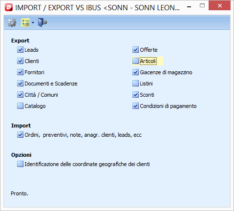

Connettore iB
=============

Introduzione
---
L'integrazione fra il gestionale Business e iB, avviene attraverso lo scambio di files in formato ascii delimitato.
Il programma che si occupa di esportare e importare i dati da e per il gestionale, è chiamato **Connettore**, ed è un modulo software che va installato nel gestionale Business.

L'installazione iniziale è molto semplice.
Basta scaricare l'ultima versione del file ConnettoreBusiness.zip e scompattarla nella cartella di installazione di Business (es:C:\Programmi\Bus).
L'ultima versione è sempre disponibile a questo link: 

  *  <https://github.com/Apex-net/ConnettoreiB/releases/latest/>

dove:

  *  ConnettoreBusiness.zip contiene tutte le dll per la prima installazione
  *  iBUpdate.zip contiene le dll per l'aggiornamento

Per lanciare il programma è sufficiente specificare il programma BNIEIBUS nella casella di lancio veloce di Business

Aggiornamento
---
Il Connettore di Business è concepito per aggiornarsi automaticamente.
Ogni volta che viene lanciato, il connettore verifica l'esistenza di un nuovo aggiornamento sui server apexnet.
Se trova una versione più recente avvisa l'utente che una nuova versione è disponibile per essere installata.
In questo caso l'utente deve uscire da tutte le sessioni di Business per consentire l'aggiornamento automatico del programma.

Rilasci del connettore
---
Per rimanere aggiornati su tutti i rilasci effettuati del connettore sono possibili 2 modalità:
1. . Registrarsi su github e mettere il progetto nei preferiti
2. . Sottoscriversi al feed https://github.com/Apex-net/ConnettoreIB/releases.atom
L'aggiornamento automatico può essere disabilitato agendo sul un apposito parametro da aggiungere nel registro di business. (si veda lista parametri).

Configurazione
---
Dopo aver copiato il contenuto dello zip nella cartella di Business, entrare dentro Business e aprire la casella di lancio del menu di Business. Digitare nella casella il nome del programma, ovvero BNIEIBUS.
Se l'installazione è stata effettuata correttamente, verrà mostrata l'interfaccia del programma (_vedi figura 1._).
A questo punto è già possibile spuntare gli archivi che si desidera esportare, ma prima di farlo occorre effettuare una minima attività configurazione.

  *  Cliccare il pulsante destro del mouse nel titolo del programma.
  *  Selezionare **Apri il registro di Business**
  *  Selezionare la sezione BUSINESS e, se non esiste, creare la sezione BSIEIBUS
  *  Selezionare la sezione BSIEIBUS e, se non esiste, creare la sezione OPZIONI
  *  Specificare l'opzione di registro obbligatoria DropBoxDir. In questo parametro mettere il percorso della cartella dropbox condivisa con apexnet.

Esistono anche altre opzioni di registro.
Di seguito l'elenco completo:

### Alert
Il connettore può essere configurato per inviare alert (come mail, popup, ecc.) al verificarsi di determinati eventi.
Per questo argomento è stato creato uno specifico articolo alla seguente pagina:

  *  [IB: Connettore di iB - Configurazione degli alert](connettore_IB_alert.md)

### Export
  *  DropBoxDir - Directory di dropbox in cui esportare e importare i dati del gestionale. (Es: c:\dropbox\ib.acme
  *  ContiEsclusi - Lista di clienti che si vuole escludere dall'estrazione (Es: 10,11,12)
  *  FiltroGGStoArt - Giorni massimi di recuper dati da storico articoli (Default: 180)
  *  FilenameEmptyImagesGetArtCatalogo - Nome del file immagine da utilizzare per articoli che non hanno foto nel catalogo (es: empty.jpg)
  *  FiltroGGDocumenti - Giorni massimi a ritroso per l'estrazione dei dati relativi ai documenti (default: 365)
  *  FiltroCliConAgenti - Se imoprtato a 1 estrae solo i clienti associati ad agenti (default 0)
  *  FiltroGGUltAcqVen - Giorni massimi a ritroso per il recupero dei dati di ultimo acquisto / vendita (default 180)
  *  IncludiLeadClienti - Se impostato a 1 estrae anche i lead collegati a clienti (default 0)

### Import
  *  SERIE_ORDINI - Per inserire gli ordini prelevati dall'iPad in una serie predefinita
  *  TIPOBF_ORDINI - Tipo Bolla fattura. Specificare la tipologia per import ordini
  *  MAGAZ_ORDINI - Magazzino ordini per import ordini da iPad

### Generali
  *  LevelUpdate - Identifica il livello di aggiornamento. Puo' assumere i seguenti valori: Release (default se non specificato), Alfa, Beta
  *  URLiBUpdate - E' possibile modificare l'indirizzo dal quale verificare gli aggiornamenti. (Il default è http://lm.apexnet.it/iBUpdate)
  *  AutoUpdate - Se presente e impostato a 0 disattiva l'aggiornamento automatico del connettore
  *  CheckboxDisabilitati - Disabilita le opzioni di interfaccia (es: CLI;FOR; disabilita checkbox clienti e checkbox fornitori
  *  CheckboxAttivi - Lista di checkbox per i quali attivare il valore di default.

### Parametri di filtro delle query
I parametri di filtro sono estremamente utili e coprono una buona parte di richieste dei clienti sui dati da visualizzare sull'ipad.

  *  Puoi scaricare le query eseguita dal connettore cliccando qui: [http://lm.apexnet.it/iBUpdate/SQL%20Statements.zip](http://lm.apexnet.it/iBUpdate/SQL%20Statements.zip.md)

Nei parametri di registro di Business (BSIEIBUS), aggiungete uno dei seguenti parametri e valorizzateli con la where da aggiungere.

Facciamo un esempio.Poniamo il caso che si desideri estrarre solo gli articoli di una determinata famiglia.

Inserite il parametro WhereGetArt

    
    AND artico.ar_famprod  = '1'

#### Clienti
  *  WhereGetClifor
  *  WhereGetCliforAge
  *  WhereGetCliforBlo
  *  WhereGetCliforDestdiv
  *  WhereGetCliforDettCon
  *  WhereGetCliforSenzaCoordinate
  *  WhereGetCliforNote

#### Articoli
  *  WhereGetArt
  *  WhereGetArtCatalogo
  *  WhereGetArtGiacenze
  *  WhereGetArtListini
  *  WhereGetArtSconti
  *  WhereGetArtStoart
  *  WhereGetArtUltAcq
  *  WhereGetArtUltVen

#### Documenti
  *  WhereGetCliforFatt
  *  WhereGetCliforRighDoc
  *  WhereGetCliforScaDoc
  *  WhereGetCliforTestDoc

#### Leads
  *  WhereGetLeadAccessi
  *  WhereGetLeadAccessiCrm
  *  WhereGetLeadDetCon
  *  WhereGetLeadNote
  *  WhereGetLeadRighOff
  *  WhereGetLeads
  *  WhereGetLeadTestOff
  *  WhereGetCampagne

#### Altro
  *  WhereGetCodpaga
  *  WhereGetComuni
  *  WhereGetAgentiCliente

### Parametri avanzati
I seguenti parametri vanno usati con attenzione e devono essere usati solo con la supervisione del personale Apexnet.

  *  QueryGetArt - Puo' contenere una query personalizzata per l'estrazione dei dati degli articoli
  *  QueryGetArtCatalogo - Puo' contenere una query personalizzata per l'estrazione dei dati degli articoli del catalogo
  *  QueryGetArtUM_EstraiTutte - Se = 1 estrae anche le UM (UM2 e CF) con fattore di conversione 0 o null

## Esecuzione del programma
A questo punto l'installazione è terminata ed è possibile selezionare gli archivi che si desidera esportare.

L'elaborazione può essere lanciata manualmente cliccando i checkbox per l'estrazione.
I dati estratti vengono depositati nelle cartelle:

  *  C:\Dropbox\ib.azienda\gestionale - Per i dati 
  *  C:\Dropbox\ib.azienda\multimedia - Per le immagini del catalogo

Per quanto riguarda l'importazione, cliccando nell'unico checkbox esistente verranno cercati i dati di ritorno dall'ipad nella cartella

  *  C:\Dropbox\ib.azienda\appmanager - Per i dati degli ordini, modifiche delle note, modifiche dei dati dei clienti

## Schedulazione
Come molti programmi di Business, è possibile creare dei preset di selezioni per l'estrazione e l'import dei dati.
Premendo la combinazione di tasti Ctrl-alt-F5, viene creati un file asci con estensione .bub.
Tale file puo' essere passato da linea di comando al programma busnet che lo prende in carico eseguendo il Connettore con le opzioni esportate nel file .bub.
Esempio:

busnet.exe UTENTE PASSWORD ARCHIVIO PROFILO

	busnet.exe admin . ACME business BNIEIBUS /B c:\bus2012\asc\bnieibus.bub

Fare riferimento alla documentazione ufficiale NTS per i dettagli.

A questo punto e' possibile creare file batch e schedularli con le opzioni pianificate di windows.

## Geolocalizzazione
Durante la prima esecuzione del Connettore, se non presenti, vengono aggiunti 2 campi personalizzati sull'anagrafica generale di Business. I due campi si chiamano rispettivamente:

  *  an_hhlat_ib - Contiene la latitudine della posizione geografica del cliente
  *  an_hhlon_ib - Contiene la longitudine della posizione geografica del cliente

Per riempire i campi con i dati delle coordinate, il connettore chiama i servizi di geolocalizzazione di google. La chiamata viene effettuata per un massimo di 500 clienti ad ogni estrazione. Questo limite è stata messo in quanto google accetta un numero massimo di 2000 richieste al giorno.
Ogni volta che vengono identificate le coordinate di 500 clienti, queste vengono memorizzate e alla successiva elaborazione non vengono piu' considerate come da elaborare.

## Personalizzazioni

### DLLMAP.INI
Creare il file DLLMAP.ini nella cartella C:\Bus\Script. Configurare come segue:

    
    DLL Chiamante|DLL standard|DLL da instanziare|nomeserver.nomeworkspace.nomeclasse dll da istanziare
    --------|--------|--------|-------------------------------------------------------------------------
    *|BDIEIBUS|BHIEIBUS|NtsInformatica.CLHIEIBUS
    *|BEIEIBUS|BFIEIBUS|NtsInformatica.CLFIEIBUS
    

### Registro di Business
Chiave da inserire in nel registro di Business (voce Opzioni)

    
    CHILD_BNIEIBUS.FRMIEIBUS  BOIEIBUS;FROIEIBUS

