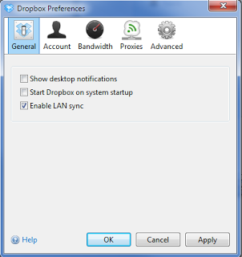

Installazione di Dropbox
===

Introduzione
---
Quando si installa il client Dropbox su un server, occorre effettuare alcune operazioni aggiuntive per eseguire il programma come servizio di windows.
L'installazione standard di Dropbox infatti, non prevede l'installazione in questa modalità. Tuttavia con poche semplici operazioni, è possibile risolvere il problema.
L'installazione come servizio, permette di eseguire Dropbox senza dover effettuare il login sul server.

Prima di procedere con la guida, occorre disporre di un account Dropbox.
Se non è ancora stato fatto, procedere con i seguenti punti:

* Collegarsi al sito di [Dropbox](http://www.dropbox.com) e clicccare su '''Sign in'''
* Registrare un account dropbox seguendo le indicazioni presenti.

Installazione del client Dropbox
---
* Scaricare il client [Dropbox](https://www.dropbox.com/downloading) ed eseguire il setup
* Inserire le credenziali dell'account dropbox
* Effettuare l'installazione di tipo avanzato e specificare la cartella '''c:\'''.Dropbox verrà installato in '''c:\Dropbox'''
* Clicccare col pulsante destro del mouse nell'icona presente nella tray area in basso a destra, andare nelle preferenze e deselezionare l'opzione '''Avvia dropbox all'avvio del sistema''' (figura 1)

	

6. Uscire da Dropbox

Dropbox come servizio
---
Installare il "Resource kit di windows."
Si tratta di una utility ufficiale di Microsoft normalmente non presente nel sistema operativo Windows server.
All'interno del resource kit è presente una utility che consente di eseguire un eseguibile generico come servizio di windows.

* Scaricare il resource kit da [questo link](http://www.microsoft.com/en-us/download/confirmation.aspx?id=17657)
* Installarlo cliccando Next ad ogni richiesta

Nota: Durante l'installazione, viene mostrata una finestra che avvisa l'utente di una incompatibilità del resource kit con la versione di Windows in uso. Ignorare l'avvertimento e continuare

* Aprire la shell dos e digitare il seguente comando: (fare attenzione al path e agli spazi)

		sc create DropBoxService binPath= "C:\Program Files (x86)\Windows Resource Kits\Tools\srvany.exe"

	Otterremo una conferma del tipo

		[SC] CreateService SUCCESS

* Andare nei servizi e modificare le proprietà del servizio chiamato Dropbox specificando l'utente e la password dell'utente Administrator

	

* Aprire il regedit e andare sotto: 

		HKEY_LOCAL_MACHINE\SYSTEM\CurrentControlSet\Services\Dropbox

* Creare una nuova chiave chiamata "Parameters"
* Sotto la chiava (folder) aggiungere una nuova stringa (tipo REG_SZ) dal nome "Application"
* Valorizzarla con il path (eseguibile compreso) di esecuzione di dropbox, ottenibile dallo shortcut del menu dei programmi, ad esempio

		C:\Users\Administrator.XXXXXXXX\AppData\Roaming\Dropbox\bin\Dropbox.exe

6. Chiudere il registry ed avviare il servizio
7. Fare il logoff ed eseguire un test di funzionamento